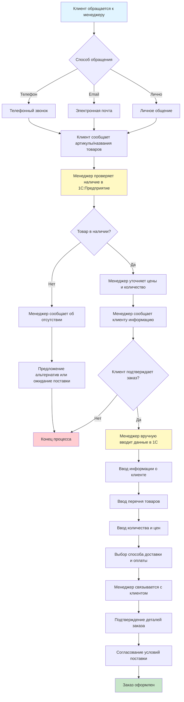
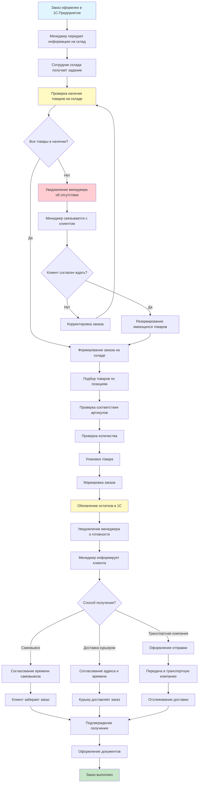
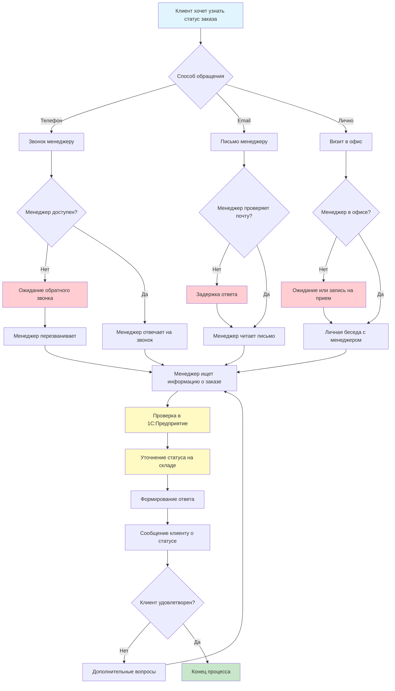

# 1.1. Анализ предметной области

## 1.1.1. Характеристика деятельности АО «Арвиай»

АО «Арвиай» является динамично развивающейся компанией, специализирующейся на оптово-розничной продаже авиационных запчастей, комплектующих и сопутствующего оборудования. Компания осуществляет свою деятельность на рынке авиационных компонентов, предоставляя услуги как крупным авиационным предприятиям, так и частным владельцам воздушных судов.

Основным направлением деятельности компании является формирование и поддержание широкого ассортимента авиационных запчастей, необходимых для технического обслуживания и ремонта воздушных судов различных типов. Ассортимент продукции компании включает несколько основных категорий товаров:

1. **Двигательные компоненты** – запчасти для авиационных двигателей, включая компрессоры, турбины, системы зажигания и другие критически важные элементы силовых установок.

2. **Шасси и тормоза** – компоненты шасси, тормозные системы, колеса, амортизаторы и сопутствующее оборудование, обеспечивающее безопасность взлета и посадки воздушных судов.

3. **Электроника и авионика** – электронные системы управления, навигационное оборудование, системы связи, приборы контроля и мониторинга, необходимые для обеспечения безопасности полетов.

Особенностью деятельности компании является необходимость работы с большим количеством технически сложных товаров, каждый из которых имеет уникальный артикул (SKU), подробные технические характеристики и специфические требования к хранению и транспортировке. Товары в ассортименте компании характеризуются высокой стоимостью, длительными сроками поставки и необходимостью строгого учета наличия на складе.

Клиентская база АО «Арвиай» включает две основные категории покупателей:

- **Оптовые клиенты** – авиационные предприятия, авиакомпании, сервисные центры, которые закупают товары крупными партиями для обеспечения производственных процессов и технического обслуживания воздушного парка.

- **Розничные клиенты** – частные владельцы воздушных судов, небольшие авиационные компании, которые приобретают товары в меньших объемах для собственных нужд.

Работа с каждой категорией клиентов имеет свои особенности. Оптовые клиенты требуют индивидуального подхода, персональных условий сотрудничества, возможности работы по договорам с отсрочкой платежа. Розничные клиенты, напротив, предпочитают быстрое оформление заказов, прозрачное ценообразование и удобные способы оплаты.

Важным аспектом деятельности компании является необходимость поддержания актуальной информации о наличии товаров на складе. В связи с высокой стоимостью авиационных запчастей и ограниченностью складских площадей, компания работает по принципу «точно в срок», что требует оперативного обновления данных о товарных остатках и синхронизации информации между различными подразделениями компании.

## 1.1.2. Анализ текущих бизнес-процессов

В настоящее время работа с клиентами в АО «Арвиай» организована преимущественно через традиционные каналы коммуникации. Основными способами приема заказов являются телефонные звонки, электронная почта и личное общение с менеджерами компании. Рассмотрим основные бизнес-процессы, связанные с обработкой заказов клиентов.

**Процесс приема заказа** начинается с обращения клиента к менеджеру компании по телефону или электронной почте. Клиент сообщает менеджеру о необходимости приобретения определенных товаров, указывая артикулы или названия запчастей. Менеджер вручную проверяет наличие товаров в системе учета 1С:Предприятие, уточняет актуальные цены и наличие на складе, после чего сообщает клиенту о возможности выполнения заказа.

В случае, если товар имеется в наличии, менеджер оформляет заказ в системе 1С:Предприятие, вводя вручную все необходимые данные: информацию о клиенте, перечень товаров, количество, цены, способ доставки и оплаты. После оформления заказа менеджер связывается с клиентом для подтверждения деталей заказа и согласования условий поставки.

Схема процесса приема заказа представлена на рисунке 1.1.

*Рисунок 1.1 – Схема процесса приема заказа*

**Процесс обработки заказа** включает несколько этапов. После получения заказа менеджер передает информацию на склад для подготовки товара к отгрузке. Сотрудники склада формируют заказ, проверяют наличие всех позиций, упаковывают товар. После подготовки заказа менеджер информирует клиента о готовности заказа и согласовывает способ доставки или время самовывоза.

Схема процесса обработки заказа представлена на рисунке 1.2.

*Рисунок 1.2 – Схема процесса обработки заказа*

**Процесс информирования клиентов** о статусе заказа осуществляется преимущественно по инициативе клиента. Клиенты вынуждены самостоятельно связываться с менеджерами для получения информации о статусе своего заказа, что создает дополнительную нагрузку на персонал компании и не всегда обеспечивает оперативное получение информации.

Схема процесса информирования клиентов представлена на рисунке 1.3.

*Рисунок 1.3 – Схема процесса информирования клиентов*

Анализ текущих бизнес-процессов выявил следующие особенности:

1. **Высокая нагрузка на менеджеров** – значительная часть рабочего времени менеджеров тратится на ручной ввод данных, проверку наличия товаров, оформление заказов и ответы на повторяющиеся вопросы клиентов.

2. **Риск ошибок при ручном вводе данных** – при оформлении заказов вручную существует вероятность ошибок в указании артикулов, количеств, цен, что может привести к несоответствию заказа требованиям клиента.

3. **Ограниченная доступность информации для клиентов** – клиенты не имеют возможности самостоятельно проверить наличие товаров, узнать актуальные цены, просмотреть технические характеристики без обращения к менеджерам.

4. **Неэффективное использование рабочего времени** – менеджеры вынуждены тратить время на выполнение рутинных операций, которые могут быть автоматизированы, что снижает их способность уделять внимание сложным вопросам и развитию клиентских отношений.

5. **Зависимость от рабочего времени** – клиенты могут оформить заказ только в рабочее время компании, что ограничивает возможности для работы с клиентами из других часовых поясов или с нестандартным графиком работы.

6. **Сложность масштабирования** – при росте количества клиентов и заказов существующая система работы требует пропорционального увеличения количества менеджеров, что увеличивает операционные расходы компании.

## 1.1.3. Выявление проблем и потребностей в автоматизации

Проведенный анализ текущих бизнес-процессов АО «Арвиай» позволил выявить ряд проблем, решение которых требует внедрения современных информационных технологий и автоматизации процессов работы с клиентами.

**Основные проблемы текущей системы работы:**

1. **Недостаточная оперативность обработки заказов** – процесс приема и обработки заказа занимает значительное время из-за необходимости ручного ввода данных, проверки наличия товаров и согласования деталей с клиентом. Это приводит к задержкам в обслуживании клиентов и снижению их удовлетворенности.

2. **Высокая операционная нагрузка на персонал** – менеджеры компании вынуждены выполнять большое количество рутинных операций, таких как проверка наличия товаров, расчет стоимости заказа, оформление документов. Это снижает эффективность их работы и ограничивает возможности для решения более сложных задач.

3. **Ограниченная доступность информации для клиентов** – клиенты не имеют возможности самостоятельно получить информацию о товарах, их наличии, ценах и технических характеристиках. Это создает зависимость от менеджеров и ограничивает возможности клиентов для принятия решений о покупке.

4. **Риск ошибок при обработке заказов** – ручной ввод данных создает вероятность ошибок в указании артикулов, количеств, цен, что может привести к несоответствию заказа требованиям клиента и необходимости его переоформления.

5. **Сложность масштабирования бизнеса** – при росте количества клиентов и заказов существующая система работы требует пропорционального увеличения количества менеджеров, что увеличивает операционные расходы и не позволяет эффективно масштабировать бизнес.

6. **Недостаточная интеграция с системой учета** – несмотря на использование системы 1С:Предприятие для учета товаров и заказов, процесс обмена данными между различными подразделениями компании не автоматизирован, что создает необходимость дублирования информации и увеличивает риск расхождений в данных.

**Потребности в автоматизации:**

На основе выявленных проблем можно определить следующие потребности в автоматизации бизнес-процессов компании:

1. **Автоматизация приема заказов** – создание системы, позволяющей клиентам самостоятельно оформлять заказы через интернет-магазин, что снизит нагрузку на менеджеров и повысит удобство для клиентов.

2. **Обеспечение доступа к актуальной информации о товарах** – создание каталога товаров с актуальной информацией о наличии, ценах и технических характеристиках, доступного клиентам в режиме реального времени.

3. **Интеграция с системой учета** – обеспечение автоматической синхронизации данных о товарных остатках и автоматической выгрузки заказов в систему 1С:Предприятие, что исключит необходимость ручного ввода данных и снизит риск ошибок.

4. **Автоматизация уведомлений клиентов** – создание системы автоматической отправки уведомлений клиентам о статусе их заказов, что повысит прозрачность процесса обработки заказа и снизит количество обращений клиентов к менеджерам.

5. **Оптимизация работы менеджеров** – создание административной панели для управления товарами, заказами и клиентами, что позволит менеджерам более эффективно обрабатывать заказы и анализировать продажи.

6. **Снижение операционных расходов** – автоматизация рутинных операций позволит снизить потребность в дополнительном персонале при росте объемов продаж, что повысит рентабельность бизнеса.

**Ожидаемые результаты автоматизации:**

Внедрение интернет-магазина с интеграцией в систему учета позволит достичь следующих результатов:

- Снижение времени обработки заказа с нескольких часов до нескольких минут за счет автоматизации процесса оформления.

- Снижение операционной нагрузки на менеджеров на 40-50% за счет автоматизации рутинных операций.

- Повышение удовлетворенности клиентов за счет возможности самостоятельного оформления заказов и получения актуальной информации о товарах.

- Снижение количества ошибок при обработке заказов за счет автоматизации ввода данных и проверки наличия товаров.

- Возможность масштабирования бизнеса без пропорционального увеличения операционных расходов.

- Повышение эффективности работы менеджеров за счет возможности сосредоточиться на решении сложных вопросов и развитии клиентских отношений.

Таким образом, анализ предметной области показал, что внедрение интернет-магазина с интеграцией в систему учета является необходимым и обоснованным решением для повышения эффективности работы АО «Арвиай» и улучшения качества обслуживания клиентов.

