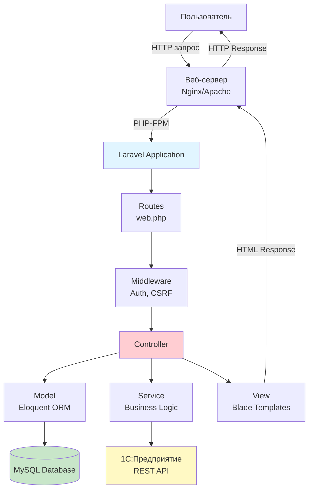
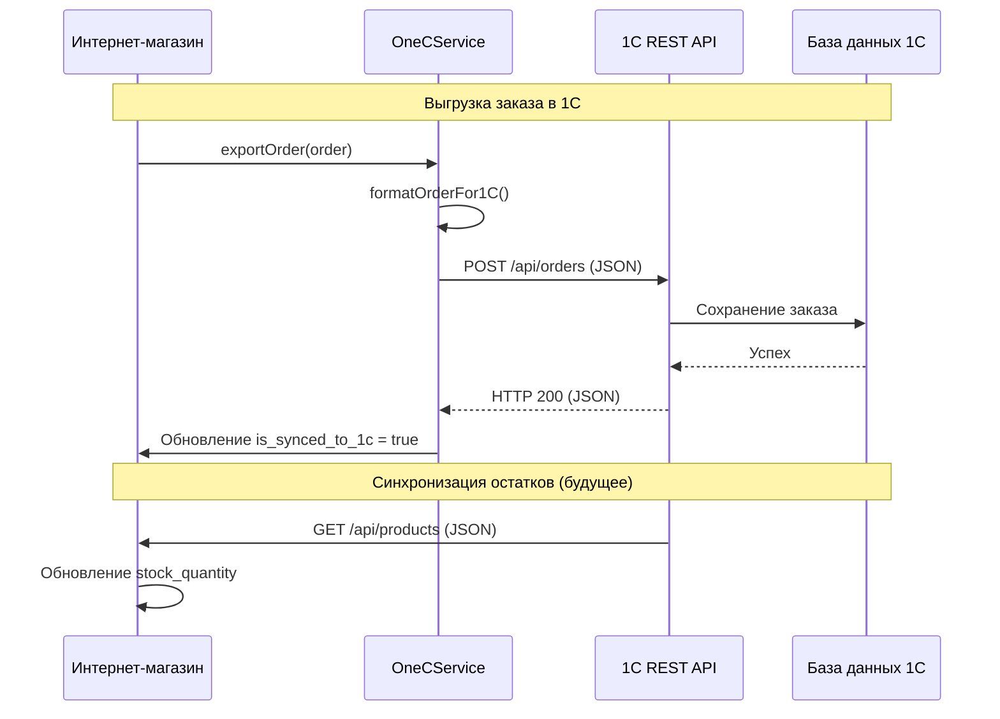

# 2.1. Проектирование архитектуры системы

## 2.1.1. Общая архитектура системы

Интернет-магазин АО «Арвиай» разработан на основе архитектурного паттерна **MVC (Model-View-Controller)**, который обеспечивает разделение логики приложения на три основных компонента: модель данных, представление и контроллер. Данный подход обеспечивает модульность системы, упрощает разработку и сопровождение кода.

### Архитектурный паттерн MVC

В архитектуре MVC каждый компонент выполняет определенную функцию:

- **Model (Модель)** – представляет данные и бизнес-логику приложения. В Laravel модели реализованы через Eloquent ORM и обеспечивают взаимодействие с базой данных, валидацию данных и выполнение бизнес-правил.

- **View (Представление)** – отвечает за отображение данных пользователю. В Laravel представления реализованы через Blade-шаблонизатор, который обеспечивает создание динамических HTML-страниц с использованием PHP-кода.

- **Controller (Контроллер)** – обрабатывает запросы пользователя, взаимодействует с моделью для получения данных и передает их в представление для отображения. Контроллеры в Laravel находятся в директории `app/Http/Controllers`.

Архитектура MVC обеспечивает разделение ответственности между компонентами системы, что упрощает разработку, тестирование и сопровождение кода.

### Структура приложения Laravel

Приложение построено на основе стандартной структуры Laravel, которая обеспечивает организацию кода и соблюдение принципов SOLID. Основные директории и их назначение:

- **app/Http/Controllers** – контроллеры, обрабатывающие HTTP-запросы
- **app/Models** – модели данных (Eloquent ORM)
- **app/Services** – сервисные классы для бизнес-логики (например, OneCService для интеграции с 1С)
- **app/Helpers** – вспомогательные классы и функции
- **app/Notifications** – классы уведомлений
- **resources/views** – Blade-шаблоны для представлений
- **routes/web.php** – определение маршрутов приложения
- **database/migrations** – миграции базы данных
- **database/seeders** – сидеры для заполнения базы данных

Схема общей архитектуры системы представлена на рисунке 2.1.



*Рисунок 2.1 – Общая архитектура системы интернет-магазина*

### Взаимодействие компонентов системы

Процесс обработки запроса в системе происходит следующим образом:

1. **Пользователь отправляет HTTP-запрос** через веб-браузер
2. **Веб-сервер** (Nginx/Apache) получает запрос и передает его в PHP-FPM
3. **Laravel Application** обрабатывает запрос:
   - Маршрутизатор определяет соответствующий контроллер и метод
   - Middleware выполняет проверки (аутентификация, CSRF-защита)
   - Контроллер обрабатывает запрос, взаимодействует с моделью и сервисами
   - Модель выполняет запросы к базе данных через Eloquent ORM
   - Сервисы выполняют бизнес-логику (например, интеграция с 1С)
   - Представление (Blade-шаблон) формирует HTML-ответ
4. **Ответ возвращается пользователю** через веб-сервер

Данная архитектура обеспечивает четкое разделение ответственности между компонентами, что упрощает разработку, тестирование и сопровождение системы.

## 2.1.2. Проектирование модульной структуры

Система интернет-магазина спроектирована как набор взаимосвязанных модулей, каждый из которых отвечает за определенную функциональность. Модульная структура обеспечивает возможность независимой разработки и тестирования компонентов, упрощает сопровождение и расширение системы.

### Модуль каталога товаров

Модуль каталога товаров обеспечивает отображение товаров, категорий, поиск и фильтрацию. Модуль включает следующие компоненты:

- **CatalogController** – контроллер для обработки запросов каталога (список товаров, фильтрация, поиск)
- **ProductController** – контроллер для отображения детальной информации о товаре
- **Category** – модель для работы с категориями товаров
- **Product** – модель для работы с товарами
- **ProductImage** – модель для работы с изображениями товаров

Модуль обеспечивает:
- Отображение иерархической структуры категорий
- Поиск товаров по названию, артикулу, описанию
- Фильтрацию товаров по категориям, цене, наличию
- Отображение карточек товаров с изображениями и характеристиками
- Страницу детального просмотра товара

### Модуль корзины и оформления заказа

Модуль корзины и оформления заказа обеспечивает формирование и оформление заказов клиентами. Модуль включает:

- **CartController** – контроллер для управления корзиной (добавление, обновление, удаление товаров)
- **OrderController** – контроллер для обработки процесса оформления заказа
- **Product** – модель для получения информации о товарах в корзине

Модуль обеспечивает:
- Добавление товаров в корзину с указанием количества
- Хранение корзины в сессии пользователя
- Трехшаговый процесс оформления заказа
- Валидацию данных на каждом шаге
- Сохранение заказа в базе данных

### Модуль управления заказами

Модуль управления заказами обеспечивает обработку заказов администраторами и интеграцию с системой 1С. Модуль включает:

- **AdminController** – контроллер для управления заказами в административной панели
- **Order** – модель для работы с заказами
- **OrderItem** – модель для работы с позициями заказов
- **OneCService** – сервис для интеграции с системой 1С
- **OrderStatusChanged** – класс уведомлений об изменении статуса заказа

Модуль обеспечивает:
- Просмотр списка заказов с фильтрацией
- Изменение статусов заказов
- Автоматическую отправку email-уведомлений
- Автоматическую выгрузку заказов в систему 1С
- Отслеживание статуса синхронизации с 1С

### Административная панель

Административная панель обеспечивает управление системой администраторами. Включает следующие модули:

- **ProductController** (Admin) – управление товарами (CRUD операции)
- **CategoryController** (Admin) – управление категориями
- **UserController** (Admin) – управление пользователями
- **OneCController** (Admin) – управление интеграцией с 1С

Каждый модуль обеспечивает полный набор операций для управления соответствующими сущностями системы.

### Модуль интеграции с 1С

Модуль интеграции с 1С обеспечивает обмен данными с системой учета 1С:Предприятие. Модуль включает:

- **OneCService** – сервисный класс для работы с API 1С
- Методы форматирования данных для выгрузки в 1С
- Обработку ответов от системы 1С
- Логирование операций интеграции

Схема модульной структуры системы представлена на рисунке 2.2.

```mermaid
graph TB
    A[Интернет-магазин АО «Арвиай»] --> B[Модуль каталога товаров]
    A --> C[Модуль корзины и заказов]
    A --> D[Модуль управления заказами]
    A --> E[Административная панель]
    A --> F[Модуль интеграции с 1С]
    
    B --> B1[CatalogController]
    B --> B2[ProductController]
    B --> B3[Category Model]
    B --> B4[Product Model]
    B --> B5[ProductImage Model]
    
    C --> C1[CartController]
    C --> C2[OrderController]
    C --> C3[Product Model]
    
    D --> D1[AdminController]
    D --> D2[Order Model]
    D --> D3[OrderItem Model]
    D --> D4[OneCService]
    D --> D5[OrderStatusChanged Notification]
    
    E --> E1[ProductController Admin]
    E --> E2[CategoryController Admin]
    E --> E3[UserController Admin]
    E --> E4[OneCController Admin]
    
    F --> F1[OneCService]
    F --> F2[1C REST API]
    
    style A fill:#E1F5FF
    style F fill:#FFF9C4
    style F2 fill:#FFCDD2
```



*Рисунок 2.2 – Модульная структура системы*

## 2.1.3. Проектирование взаимодействия с внешними системами

Критически важным аспектом архитектуры системы является интеграция с системой 1С:Предприятие для автоматической синхронизации данных о товарных остатках и выгрузки заказов.

### Схема интеграции с 1С:Предприятие

Интеграция реализована через REST API с использованием HTTP-запросов. Система интернет-магазина выступает в роли клиента, отправляющего запросы к API системы 1С.

Схема интеграции представлена на рисунке 2.3.



*Рисунок 2.3 – Схема интеграции с системой 1С:Предприятие*

### Протокол обмена данными

Обмен данными между интернет-магазином и системой 1С осуществляется по протоколу HTTP/HTTPS с использованием формата JSON. 

**Формат запроса на выгрузку заказа:**

```json
{
  "order_id": 123,
  "order_number": "ORD-000123",
  "date": "2025-12-01T15:30:00",
  "status": "Новый",
  "total_amount": 15000.00,
  "payment_method": "Наличные",
  "delivery_method": "Самовывоз",
  "customer": {
    "name": "Иван Иванов",
    "phone": "+7 (999) 123-45-67",
    "email": "ivan@example.com",
    "address": "г. Москва, ул. Примерная, д. 1"
  },
  "items": [
    {
      "sku": "PART-001",
      "name": "Авиационная запчасть",
      "quantity": 2,
      "price": 5000.00,
      "total": 10000.00
    }
  ],
  "comment": "Комментарий к заказу"
}
```

**Аутентификация** осуществляется через Basic Authentication с использованием учетных данных, указанных в конфигурации системы.

**Метод запроса:** POST  
**Endpoint:** `{ONEC_BASE_URL}/api/orders`  
**Content-Type:** `application/json`  
**Authorization:** `Basic {base64(username:password)}`

### Обработка ошибок интеграции

Система предусматривает обработку различных типов ошибок при интеграции с 1С:

1. **Ошибки сети** (таймаут, недоступность сервера) – система логирует ошибку и оставляет заказ с флагом `is_synced_to_1c = false` для повторной попытки выгрузки

2. **Ошибки аутентификации** (401 Unauthorized) – система логирует ошибку и уведомляет администратора о необходимости проверки учетных данных

3. **Ошибки валидации данных** (400 Bad Request) – система логирует ошибку с деталями ответа от 1С для анализа и исправления

4. **Ошибки сервера 1С** (500 Internal Server Error) – система логирует ошибку и оставляет заказ для повторной попытки выгрузки

Все ошибки логируются в файл `storage/logs/laravel.log` с указанием времени, типа ошибки, деталей запроса и ответа от системы 1С.

### Механизм повторной выгрузки

Для обеспечения надежности интеграции реализован механизм повторной выгрузки заказов:

- Автоматическая выгрузка при изменении статуса заказа на "Новый" или "В обработке"
- Возможность ручной выгрузки через административную панель
- Команда `php artisan 1c:sync-orders` для массовой выгрузки всех невыгруженных заказов

Данный подход обеспечивает надежность интеграции и возможность восстановления после временных сбоев в работе системы 1С.

### Выводы по разделу

Проектирование архитектуры системы выполнено на основе паттерна MVC с использованием возможностей фреймворка Laravel. Модульная структура обеспечивает четкое разделение ответственности между компонентами системы, что упрощает разработку, тестирование и сопровождение.

Интеграция с системой 1С:Предприятие спроектирована на основе REST API, что обеспечивает простоту реализации, высокую производительность и надежность обмена данными. Механизм обработки ошибок и повторной выгрузки гарантирует целостность данных и возможность восстановления после сбоев.

