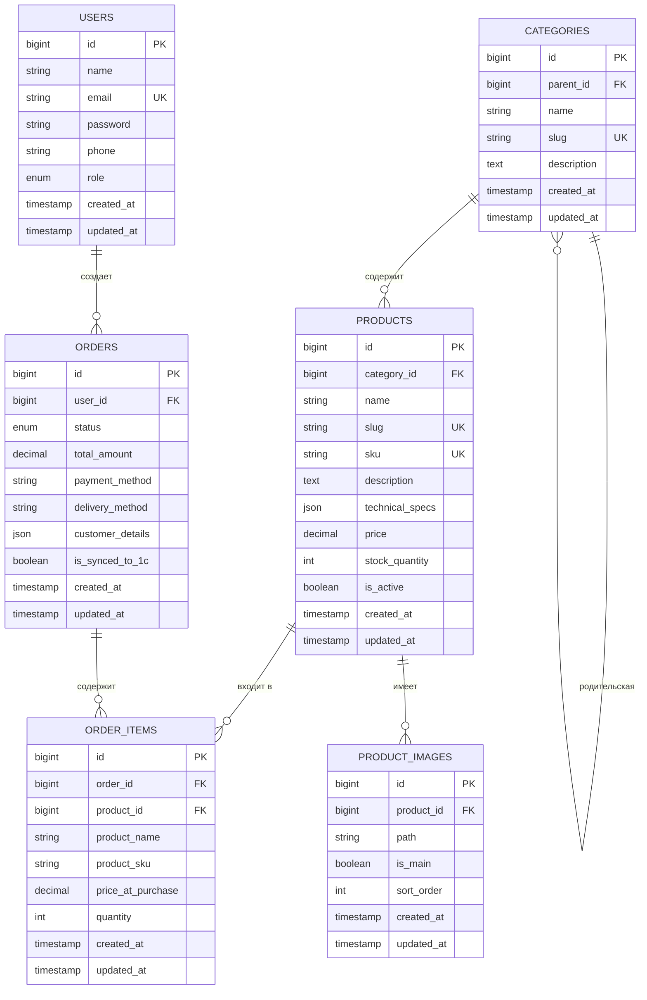

# 2.2. Проектирование базы данных

## 2.2.1. Концептуальная модель данных

Концептуальная модель данных представляет собой высокоуровневое описание структуры данных системы интернет-магазина без привязки к конкретной СУБД. Модель отражает основные сущности предметной области и связи между ними.

### ER-диаграмма базы данных

Концептуальная модель данных представлена в виде ER-диаграммы (Entity-Relationship), которая отображает основные сущности системы и их взаимосвязи (рисунок 2.4).



*Рисунок 2.4 – ER-диаграмма базы данных интернет-магазина*

### Описание сущностей и их атрибутов

База данных интернет-магазина включает следующие основные сущности:

**1. USERS (Пользователи)**

Сущность представляет пользователей системы: администраторов и клиентов. Атрибуты:
- `id` – уникальный идентификатор пользователя (первичный ключ)
- `name` – имя пользователя
- `email` – электронная почта (уникальный ключ)
- `password` – хешированный пароль
- `phone` – номер телефона (опционально)
- `role` – роль пользователя: 'admin' или 'client'
- `created_at`, `updated_at` – временные метки создания и обновления

**2. CATEGORIES (Категории)**

Сущность представляет иерархическую структуру категорий товаров. Атрибуты:
- `id` – уникальный идентификатор категории (первичный ключ)
- `parent_id` – идентификатор родительской категории (внешний ключ, опционально)
- `name` – название категории
- `slug` – URL-адрес категории (уникальный ключ)
- `description` – описание категории (опционально)
- `created_at`, `updated_at` – временные метки

**3. PRODUCTS (Товары)**

Сущность представляет товары, продаваемые в интернет-магазине. Атрибуты:
- `id` – уникальный идентификатор товара (первичный ключ)
- `category_id` – идентификатор категории (внешний ключ, опционально)
- `name` – название товара
- `slug` – URL-адрес товара (уникальный ключ)
- `sku` – артикул товара (уникальный ключ, используется для интеграции с 1С)
- `description` – описание товара (опционально)
- `technical_specs` – технические характеристики в формате JSON (опционально)
- `price` – цена товара
- `stock_quantity` – количество товара на складе
- `is_active` – флаг активности товара
- `created_at`, `updated_at` – временные метки

**4. PRODUCT_IMAGES (Изображения товаров)**

Сущность представляет изображения товаров. Атрибуты:
- `id` – уникальный идентификатор изображения (первичный ключ)
- `product_id` – идентификатор товара (внешний ключ)
- `path` – путь к файлу изображения
- `is_main` – флаг главного изображения
- `sort_order` – порядок сортировки изображений
- `created_at`, `updated_at` – временные метки

**5. ORDERS (Заказы)**

Сущность представляет заказы клиентов. Атрибуты:
- `id` – уникальный идентификатор заказа (первичный ключ)
- `user_id` – идентификатор пользователя (внешний ключ, опционально для гостевых заказов)
- `status` – статус заказа: 'new', 'processing', 'completed', 'cancelled'
- `total_amount` – общая сумма заказа
- `payment_method` – способ оплаты
- `delivery_method` – способ доставки
- `customer_details` – детали клиента в формате JSON (имя, телефон, адрес, email)
- `is_synced_to_1c` – флаг синхронизации с системой 1С
- `created_at`, `updated_at` – временные метки

**6. ORDER_ITEMS (Позиции заказа)**

Сущность представляет товары, входящие в заказ. Атрибуты:
- `id` – уникальный идентификатор позиции (первичный ключ)
- `order_id` – идентификатор заказа (внешний ключ)
- `product_id` – идентификатор товара (внешний ключ, опционально)
- `product_name` – название товара на момент покупки (сохраняется для истории)
- `product_sku` – артикул товара на момент покупки
- `price_at_purchase` – цена товара на момент покупки
- `quantity` – количество товара
- `created_at`, `updated_at` – временные метки

### Связи между сущностями

Между сущностями установлены следующие связи:

1. **USERS → ORDERS** (один-ко-многим): один пользователь может создать множество заказов. Связь необязательная (NULL для гостевых заказов), при удалении пользователя заказы сохраняются (`ON DELETE SET NULL`).

2. **CATEGORIES → CATEGORIES** (самосвязь, один-ко-многим): категория может иметь множество подкатегорий. Связь необязательная (NULL для корневых категорий), при удалении родительской категории подкатегории сохраняются (`ON DELETE SET NULL`).

3. **CATEGORIES → PRODUCTS** (один-ко-многим): одна категория может содержать множество товаров. Связь необязательная, при удалении категории товары сохраняются (`ON DELETE SET NULL`).

4. **PRODUCTS → PRODUCT_IMAGES** (один-ко-многим): один товар может иметь множество изображений. Связь обязательная, при удалении товара изображения удаляются (`ON DELETE CASCADE`).

5. **PRODUCTS → ORDER_ITEMS** (один-ко-многим): один товар может входить в множество позиций заказов. Связь необязательная (товар может быть удален), при удалении товара позиции заказа сохраняются (`ON DELETE SET NULL`).

6. **ORDERS → ORDER_ITEMS** (один-ко-многим): один заказ содержит множество позиций. Связь обязательная, при удалении заказа позиции удаляются (`ON DELETE CASCADE`).

## 2.2.2. Логическая модель данных

Логическая модель данных представляет структуру базы данных с учетом правил нормализации и оптимизации для реляционной СУБД MySQL.

### Нормализация базы данных

База данных спроектирована в соответствии с требованиями третьей нормальной формы (3NF) [5; 9; 15; 19]:

**Первая нормальная форма (1NF):** все атрибуты атомарны, каждая таблица имеет первичный ключ. Выполнено.

**Вторая нормальная форма (2NF):** все неключевые атрибуты полностью зависят от первичного ключа. Выполнено.

**Третья нормальная форма (3NF):** неключевые атрибуты не зависят друг от друга. Выполнено.

**Денормализация для оптимизации:**

В некоторых случаях применена контролируемая денормализация для повышения производительности:

- В таблице `order_items` сохранены `product_name`, `product_sku` и `price_at_purchase` для обеспечения целостности исторических данных, даже если товар будет удален или изменен.

- В таблице `orders` используется JSON-поле `customer_details` для хранения данных клиента, что упрощает структуру и позволяет хранить дополнительные поля без изменения схемы.

### Описание таблиц и полей

**Таблица `users`**

Хранит информацию о пользователях системы (администраторах и клиентах).

| Поле | Тип | Ограничения | Описание |
|------|-----|-------------|----------|
| id | BIGINT UNSIGNED | PRIMARY KEY, AUTO_INCREMENT | Уникальный идентификатор |
| name | VARCHAR(255) | NOT NULL | Имя пользователя |
| email | VARCHAR(255) | NOT NULL, UNIQUE | Электронная почта |
| email_verified_at | TIMESTAMP | NULL | Дата подтверждения email |
| password | VARCHAR(255) | NOT NULL | Хешированный пароль |
| phone | VARCHAR(20) | NULL | Номер телефона |
| role | ENUM('admin', 'client') | NOT NULL, DEFAULT 'client' | Роль пользователя |
| remember_token | VARCHAR(100) | NULL | Токен для "запомнить меня" |
| created_at | TIMESTAMP | NULL | Дата создания |
| updated_at | TIMESTAMP | NULL | Дата обновления |

**Таблица `categories`**

Хранит иерархическую структуру категорий товаров.

| Поле | Тип | Ограничения | Описание |
|------|-----|-------------|----------|
| id | BIGINT UNSIGNED | PRIMARY KEY, AUTO_INCREMENT | Уникальный идентификатор |
| parent_id | BIGINT UNSIGNED | NULL, FOREIGN KEY | Родительская категория |
| name | VARCHAR(255) | NOT NULL | Название категории |
| slug | VARCHAR(255) | NOT NULL, UNIQUE | URL-адрес категории |
| description | TEXT | NULL | Описание категории |
| created_at | TIMESTAMP | NULL | Дата создания |
| updated_at | TIMESTAMP | NULL | Дата обновления |

**Таблица `products`**

Хранит информацию о товарах.

| Поле | Тип | Ограничения | Описание |
|------|-----|-------------|----------|
| id | BIGINT UNSIGNED | PRIMARY KEY, AUTO_INCREMENT | Уникальный идентификатор |
| category_id | BIGINT UNSIGNED | NULL, FOREIGN KEY | Категория товара |
| name | VARCHAR(255) | NOT NULL | Название товара |
| slug | VARCHAR(255) | NOT NULL, UNIQUE | URL-адрес товара |
| sku | VARCHAR(100) | NOT NULL, UNIQUE | Артикул товара |
| description | TEXT | NULL | Описание товара |
| technical_specs | JSON | NULL | Технические характеристики |
| price | DECIMAL(10,2) | NOT NULL, DEFAULT 0.00 | Цена товара |
| stock_quantity | INT | NOT NULL, DEFAULT 0 | Остаток на складе |
| is_active | BOOLEAN | NOT NULL, DEFAULT TRUE | Флаг активности |
| created_at | TIMESTAMP | NULL | Дата создания |
| updated_at | TIMESTAMP | NULL | Дата обновления |

**Таблица `product_images`**

Хранит пути к изображениям товаров.

| Поле | Тип | Ограничения | Описание |
|------|-----|-------------|----------|
| id | BIGINT UNSIGNED | PRIMARY KEY, AUTO_INCREMENT | Уникальный идентификатор |
| product_id | BIGINT UNSIGNED | NOT NULL, FOREIGN KEY | Товар |
| path | VARCHAR(255) | NOT NULL | Путь к файлу |
| is_main | BOOLEAN | NOT NULL, DEFAULT FALSE | Главное изображение |
| sort_order | INT | DEFAULT 0 | Порядок сортировки |
| created_at | TIMESTAMP | NULL | Дата создания |
| updated_at | TIMESTAMP | NULL | Дата обновления |

**Таблица `orders`**

Хранит информацию о заказах клиентов.

| Поле | Тип | Ограничения | Описание |
|------|-----|-------------|----------|
| id | BIGINT UNSIGNED | PRIMARY KEY, AUTO_INCREMENT | Уникальный идентификатор |
| user_id | BIGINT UNSIGNED | NULL, FOREIGN KEY | Пользователь (NULL для гостей) |
| status | ENUM | NOT NULL, DEFAULT 'new' | Статус заказа |
| total_amount | DECIMAL(10,2) | NOT NULL | Общая сумма |
| payment_method | VARCHAR(50) | NOT NULL | Способ оплаты |
| delivery_method | VARCHAR(50) | NOT NULL | Способ доставки |
| customer_details | JSON | NOT NULL | Данные клиента |
| is_synced_to_1c | BOOLEAN | DEFAULT FALSE | Флаг синхронизации с 1С |
| created_at | TIMESTAMP | NULL | Дата создания |
| updated_at | TIMESTAMP | NULL | Дата обновления |

**Таблица `order_items`**

Хранит позиции заказов.

| Поле | Тип | Ограничения | Описание |
|------|-----|-------------|----------|
| id | BIGINT UNSIGNED | PRIMARY KEY, AUTO_INCREMENT | Уникальный идентификатор |
| order_id | BIGINT UNSIGNED | NOT NULL, FOREIGN KEY | Заказ |
| product_id | BIGINT UNSIGNED | NULL, FOREIGN KEY | Товар (NULL если удален) |
| product_name | VARCHAR(255) | NOT NULL | Название на момент покупки |
| product_sku | VARCHAR(100) | NOT NULL | Артикул на момент покупки |
| price_at_purchase | DECIMAL(10,2) | NOT NULL | Цена на момент покупки |
| quantity | INT | NOT NULL, DEFAULT 1 | Количество |
| created_at | TIMESTAMP | NULL | Дата создания |
| updated_at | TIMESTAMP | NULL | Дата обновления |

### Индексы и ограничения

Для обеспечения производительности запросов и целостности данных созданы следующие индексы:

**Первичные ключи (PRIMARY KEY):**
- Все таблицы имеют первичный ключ `id` типа `BIGINT UNSIGNED AUTO_INCREMENT`

**Уникальные индексы (UNIQUE):**
- `users.email` – уникальность email-адресов
- `categories.slug` – уникальность URL-адресов категорий
- `products.slug` – уникальность URL-адресов товаров
- `products.sku` – уникальность артикулов товаров

**Внешние ключи (FOREIGN KEY):**
- `categories.parent_id` → `categories.id` (ON DELETE SET NULL)
- `products.category_id` → `categories.id` (ON DELETE SET NULL)
- `product_images.product_id` → `products.id` (ON DELETE CASCADE)
- `orders.user_id` → `users.id` (ON DELETE SET NULL)
- `order_items.order_id` → `orders.id` (ON DELETE CASCADE)
- `order_items.product_id` → `products.id` (ON DELETE SET NULL)

**Полнотекстовый индекс:**
- `products` – FULLTEXT индекс по полям `name`, `sku`, `description` для быстрого поиска товаров

**Обычные индексы:**
- `products.category_id` – для быстрого поиска товаров по категории
- `products.is_active` – для фильтрации активных товаров
- `orders.user_id` – для быстрого поиска заказов пользователя
- `orders.status` – для фильтрации заказов по статусу
- `orders.is_synced_to_1c` – для поиска невыгруженных заказов

## 2.2.3. Физическая модель данных

Физическая модель данных определяет конкретную реализацию базы данных в СУБД MySQL с учетом типов данных, размеров полей и особенностей хранения.

### Типы данных и размеры полей

**Целочисленные типы:**
- `BIGINT UNSIGNED` (8 байт) – для первичных ключей и внешних ключей, обеспечивает поддержку до 18 446 744 073 709 551 615 записей
- `INT` (4 байта) – для числовых полей (количество, порядок сортировки), диапазон от -2 147 483 648 до 2 147 483 647

**Строковые типы:**
- `VARCHAR(255)` – для коротких строк (имена, email, slug), максимальная длина 255 символов
- `VARCHAR(100)` – для артикулов и коротких кодов
- `VARCHAR(50)` – для способов оплаты и доставки
- `VARCHAR(20)` – для номеров телефонов
- `TEXT` – для длинных текстов (описания), до 65 535 символов

**Числовые типы с плавающей точкой:**
- `DECIMAL(10,2)` – для денежных сумм, обеспечивает точность до 2 знаков после запятой, диапазон от -99 999 999.99 до 99 999 999.99

**Логические типы:**
- `BOOLEAN` – для флагов (эквивалентно TINYINT(1)), значения 0 (FALSE) или 1 (TRUE)

**Временные типы:**
- `TIMESTAMP` – для хранения даты и времени создания/обновления записей, автоматически обновляется при изменении записи

**JSON тип:**
- `JSON` – для хранения структурированных данных (технические характеристики товаров, данные клиента), поддерживается в MySQL 5.7.8+

**Перечисления:**
- `ENUM` – для ограниченного набора значений (статусы заказов, роли пользователей), экономит место и обеспечивает валидацию на уровне БД

### Внешние ключи и связи

Все внешние ключи определены с соответствующими правилами каскадного удаления:

1. **`categories.parent_id` → `categories.id`**
   - `ON DELETE SET NULL` – при удалении родительской категории подкатегории сохраняются, `parent_id` устанавливается в NULL

2. **`products.category_id` → `categories.id`**
   - `ON DELETE SET NULL` – при удалении категории товары сохраняются, `category_id` устанавливается в NULL

3. **`product_images.product_id` → `products.id`**
   - `ON DELETE CASCADE` – при удалении товара все его изображения удаляются автоматически

4. **`orders.user_id` → `users.id`**
   - `ON DELETE SET NULL` – при удалении пользователя заказы сохраняются для истории, `user_id` устанавливается в NULL

5. **`order_items.order_id` → `orders.id`**
   - `ON DELETE CASCADE` – при удалении заказа все его позиции удаляются автоматически

6. **`order_items.product_id` → `products.id`**
   - `ON DELETE SET NULL` – при удалении товара позиции заказов сохраняются для истории, `product_id` устанавливается в NULL

### Полнотекстовые индексы

Для обеспечения быстрого поиска товаров по названию, артикулу и описанию создан полнотекстовый индекс:

```sql
ALTER TABLE products 
ADD FULLTEXT INDEX idx_fulltext_search (name, sku, description);
```

Полнотекстовый индекс позволяет выполнять поиск с использованием оператора `MATCH() AGAINST()`:

```sql
SELECT * FROM products 
WHERE MATCH(name, sku, description) AGAINST('запчасть' IN NATURAL LANGUAGE MODE);
```

Это обеспечивает:
- Быстрый поиск по нескольким полям одновременно
- Ранжирование результатов по релевантности
- Поддержку естественного языка и стоп-слов

**Ограничения полнотекстового индекса:**
- Поддерживается только для таблиц типа MyISAM или InnoDB (MySQL 5.6+)
- Минимальная длина слова для индексации – 3-4 символа (зависит от конфигурации)
- Не поддерживается для полей типа JSON

### Оптимизация производительности

Для обеспечения высокой производительности базы данных применены следующие оптимизации:

1. **Индексация часто используемых полей** – созданы индексы на полях, используемых в условиях WHERE и JOIN

2. **Использование внешних ключей** – обеспечивает целостность данных и оптимизацию JOIN-запросов

3. **Правильный выбор типов данных** – использование минимально необходимых типов данных экономит место и ускоряет операции

4. **Денормализация для истории** – сохранение данных на момент покупки в `order_items` исключает необходимость JOIN с таблицей `products` для исторических данных

5. **JSON для гибких данных** – использование JSON-полей для технических характеристик и данных клиента позволяет хранить переменную структуру без изменения схемы БД

### Выводы по разделу

Проектирование базы данных выполнено с учетом требований нормализации, целостности данных и производительности. Использование иерархической структуры категорий, JSON-полей для гибких данных и сохранение исторических данных в позициях заказов обеспечивает функциональность системы и возможность масштабирования [5; 9; 15; 19].

Полнотекстовый индекс для поиска товаров, правильная индексация и оптимизация типов данных обеспечивают высокую производительность запросов даже при большом объеме данных.

