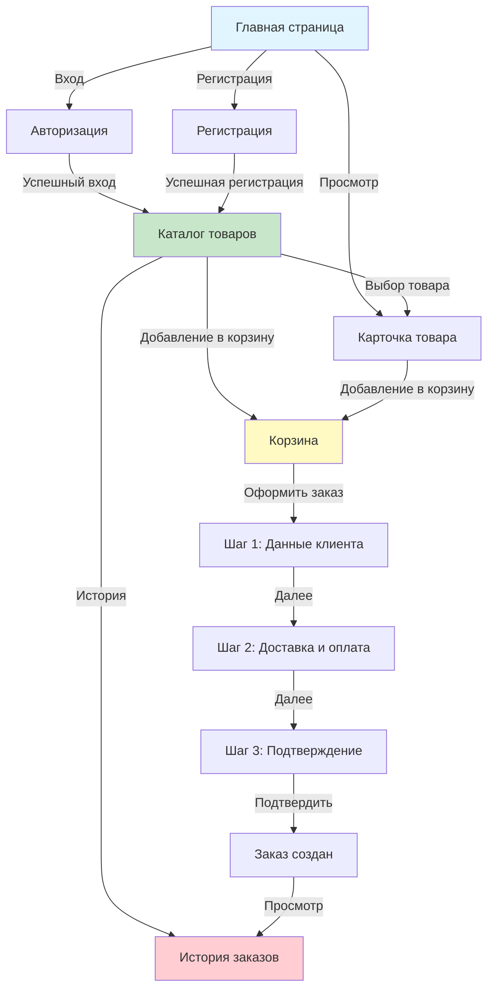

# 2.3. Проектирование пользовательского интерфейса

## 2.3.1. Проектирование интерфейса клиентской части

Интерфейс клиентской части интернет-магазина спроектирован с учетом принципов удобства использования (usability) и современного веб-дизайна. Основной задачей является обеспечение простоты навигации, быстрого поиска товаров и удобного процесса оформления заказа [3; 12].

### Структура навигации

Навигационная структура клиентской части включает следующие основные разделы:

**Для неавторизованных пользователей (гостей):**
- Главная страница (`/`) – лендинг с информацией о компании и превью товаров
- Вход в систему (`/login`) – форма авторизации
- Регистрация (`/register`) – форма регистрации нового пользователя
- Просмотр товара (`/product/{slug}`) – детальная информация о товаре (доступна без авторизации)

**Для авторизованных пользователей (клиентов):**
- Каталог товаров (`/dashboard`) – основной каталог с поиском и фильтрацией
- Корзина (`/cart`) – просмотр и редактирование корзины
- Оформление заказа (`/checkout/step1`, `/checkout/step2`, `/checkout/step3`) – трехшаговый процесс оформления
- История заказов (`/orders`) – просмотр истории заказов клиента

Схема навигации клиентской части представлена на рисунке 2.5.

*Рисунок 2.5 – Схема навигации клиентской части интернет-магазина*

### Макеты основных страниц

**1. Главная страница (лендинг)**

Главная страница предназначена для неавторизованных пользователей и содержит:
- **Шапка сайта** с логотипом компании и кнопками "Регистрация" и "Войти"
- **Герой-секция** с призывом к действию и кратким описанием компании
- **Превью категорий товаров** с изображениями и названиями
- **Превью популярных товаров** с карточками товаров (название, цена, изображение)
- **Футер** с контактной информацией

Дизайн выполнен в сине-индиговой цветовой гамме, соответствующей тематике авиации.

**2. Каталог товаров**

Страница каталога является центральным элементом интерфейса и включает:
- **Шапка** с логотипом, навигацией (Каталог, Корзина, История заказов, Выход) и кнопкой перехода в админ-панель (для администраторов)
- **Панель поиска и фильтров:**
  - Поле поиска по названию, артикулу, описанию
  - Фильтр по категориям (иерархический список)
  - Фильтр по цене (диапазон)
  - Фильтр по наличию на складе
  - Сортировка (по цене, названию, дате добавления)
- **Сетка товаров** с карточками товаров, отображающими:
  - Главное изображение товара
  - Название товара
  - Артикул (SKU)
  - Цену
  - Количество на складе
  - Кнопку "В корзину"
- **Пагинация** для навигации по страницам при большом количестве товаров

**3. Карточка товара**

Страница детального просмотра товара содержит:
- **Хлебные крошки** для навигации (Главная → Категория → Товар)
- **Галерея изображений** с возможностью просмотра всех изображений товара
- **Основная информация:**
  - Название товара
  - Артикул (SKU)
  - Цена
  - Количество на складе
  - Кнопка "Добавить в корзину" с выбором количества
- **Описание товара** с полным текстовым описанием
- **Технические характеристики** в структурированном виде (из JSON-поля `technical_specs`)
- **Связанные товары** (товары из той же категории)

**4. Корзина**

Страница корзины позволяет управлять выбранными товарами:
- **Список товаров в корзине** с отображением:
  - Изображения товара
  - Названия и артикула
  - Цены за единицу
  - Количества (с возможностью изменения)
  - Общей стоимости позиции
  - Кнопки удаления товара
- **Итоговая информация:**
  - Общее количество товаров
  - Общая сумма заказа
- **Кнопка "Оформить заказ"** для перехода к процессу оформления
- **Кнопка "Очистить корзину"** для удаления всех товаров

**5. Оформление заказа (трехшаговый процесс)**

Процесс оформления заказа разделен на три последовательных шага для упрощения и снижения количества ошибок:

**Шаг 1: Данные клиента**
- Поля формы:
  - Имя (обязательное)
  - Телефон (обязательное)
  - Email (обязательное, валидация формата)
  - Адрес доставки (обязательное)
  - Комментарий к заказу (опциональное)
- Кнопки: "Назад" (в корзину), "Далее"

**Шаг 2: Способ доставки и оплаты**
- Выбор способа доставки:
  - Самовывоз
  - Курьерская доставка
  - Транспортная компания
- Выбор способа оплаты:
  - Наличные
  - Банковская карта
  - Банковский перевод
- Кнопки: "Назад", "Далее"

**Шаг 3: Подтверждение заказа**
- Сводная информация:
  - Данные клиента
  - Состав заказа (список товаров с ценами и количеством)
  - Способ доставки и оплаты
  - Итоговая сумма
- Кнопки: "Назад" (к шагу 2), "Подтвердить заказ"

После подтверждения заказа пользователь перенаправляется на страницу истории заказов с сообщением об успешном создании заказа.

**6. История заказов**

Страница истории заказов отображает:
- **Список заказов** с информацией:
  - Номер заказа
  - Дата создания
  - Статус заказа (с цветовой индикацией)
  - Общая сумма
  - Кнопка "Подробнее" для просмотра деталей заказа
- **Фильтрация** по статусу заказа (опционально)
- **Детальный просмотр заказа** (модальное окно или отдельная страница) с полной информацией о заказе

### Адаптивный дизайн

Интерфейс клиентской части спроектирован с учетом адаптивности для различных устройств:

**Мобильные устройства (до 768px):**
- Вертикальная навигация (гамбургер-меню)
- Одноколоночная сетка товаров
- Упрощенная панель фильтров (выпадающие списки)
- Оптимизированные формы с крупными полями ввода
- Крупные кнопки для удобного нажатия

**Планшеты (768px - 1024px):**
- Двухколоночная сетка товаров
- Горизонтальная навигация
- Полная панель фильтров

**Десктоп (свыше 1024px):**
- Трех-четырехколоночная сетка товаров
- Полная горизонтальная навигация
- Расширенная панель фильтров с видимыми опциями
- Боковая панель для дополнительной информации

**Технические решения для адаптивности:**
- Использование CSS-фреймворка Tailwind CSS с responsive-классами
- Flexbox и CSS Grid для гибкой компоновки элементов
- Медиа-запросы для адаптации стилей под различные размеры экранов
- Оптимизация изображений (lazy loading, responsive images)

## 2.3.2. Проектирование интерфейса административной панели

Административная панель предназначена для управления системой интернет-магазина администраторами. Интерфейс спроектирован с акцентом на функциональность, информативность и эффективность работы.

### Структура административной панели

Административная панель имеет единую структуру навигации на всех страницах:

**Горизонтальное меню навигации:**
- **Дашборд** (`/admin/dashboard`) – главная страница с общей статистикой
- **Заказы** (`/admin/orders`) – управление заказами
- **Товары** (`/admin/products`) – управление товарами
- **Категории** (`/admin/categories`) – управление категориями
- **Пользователи** (`/admin/users`) – управление пользователями
- **1С** (`/admin/onec`) – управление интеграцией с 1С

**Дополнительные элементы навигации:**
- Кнопка "Клиентская часть" для быстрого перехода в каталог
- Отображение имени текущего администратора
- Кнопка "Выйти" для выхода из системы

Схема структуры административной панели представлена на рисунке 2.6.

```mermaid
graph TB
    A[Админ-панель] --> B[Дашборд]
    A --> C[Заказы]
    A --> D[Товары]
    A --> E[Категории]
    A --> F[Пользователи]
    A --> G[Интеграция 1С]
    
    C --> C1[Список заказов]
    C --> C2[Детали заказа]
    C --> C3[Изменение статуса]
    
    D --> D1[Список товаров]
    D --> D2[Создание товара]
    D --> D3[Редактирование товара]
    D --> D4[Управление изображениями]
    
    E --> E1[Список категорий]
    E --> E2[Создание категории]
    E --> E3[Редактирование категории]
    
    F --> F1[Список пользователей]
    F --> F2[Создание пользователя]
    F --> F3[Редактирование пользователя]
    
    G --> G1[Статус синхронизации]
    G --> G2[Ручная выгрузка заказов]
    
    style A fill:#E1F5FF
    style C fill:#FFCDD2
    style D fill:#C8E6C9
    style G fill:#FFF9C4
```

*Рисунок 2.6 – Схема структуры административной панели*

### Макеты страниц управления

**1. Дашборд (главная страница)**

Дашборд предоставляет общий обзор состояния системы:
- **Статистические карточки:**
  - Всего заказов
  - Новые заказы (требующие обработки)
  - Активные заказы (в обработке)
  - Всего пользователей
- **Последние заказы** – таблица с последними 5-10 заказами:
  - Номер заказа
  - Клиент
  - Дата создания
  - Статус
  - Сумма
  - Ссылка на детали заказа
- **Быстрые действия** – кнопки для быстрого перехода к основным разделам

**2. Управление заказами**

Страница управления заказами включает:
- **Панель фильтров:**
  - Фильтр по статусу (Все, Новые, В обработке, Выполненные, Отмененные)
  - Поиск по номеру заказа, имени клиента, телефону
- **Таблица заказов** с колонками:
  - Номер заказа
  - Клиент (имя, телефон)
  - Дата создания
  - Статус (с цветовой индикацией)
  - Сумма
  - Статус синхронизации с 1С
  - Действия (Просмотр, Изменить статус)
- **Детальная страница заказа:**
  - Полная информация о клиенте
  - Состав заказа (таблица с товарами)
  - Способ доставки и оплаты
  - История изменений статуса
  - Форма изменения статуса заказа
  - Кнопка ручной выгрузки в 1С (если не выгружен)

**3. Управление товарами**

Страница управления товарами обеспечивает полный CRUD-функционал:
- **Список товаров:**
  - Таблица с колонками: Название, Артикул, Категория, Цена, Остаток, Статус, Действия
  - Поиск по названию и артикулу
  - Фильтр по категории
  - Кнопка "Добавить товар"
- **Форма создания/редактирования товара:**
  - Основная информация:
    - Название товара
    - Артикул (SKU) – уникальный, обязательный
    - Категория (выпадающий список)
    - Описание (текстовое поле с редактором)
    - Цена
    - Остаток на складе
    - Статус активности (чекбокс)
  - Технические характеристики:
    - JSON-редактор или форма с динамическими полями
  - Изображения товара:
    - Загрузка нескольких изображений
    - Установка главного изображения
    - Удаление изображений
    - Предпросмотр изображений
- **Валидация полей** с отображением ошибок

**4. Управление категориями**

Страница управления категориями поддерживает иерархическую структуру:
- **Древовидный список категорий:**
  - Отображение иерархии (родительские и дочерние категории)
  - Индикация уровня вложенности
  - Кнопки действий для каждой категории
- **Форма создания/редактирования категории:**
  - Название категории
  - Родительская категория (выпадающий список, опционально)
  - URL-адрес (slug) – автоматическая генерация из названия
  - Описание категории
- **Валидация** уникальности slug и проверка циклических ссылок

**5. Управление пользователями**

Страница управления пользователями:
- **Список пользователей:**
  - Таблица с колонками: Имя, Email, Телефон, Роль, Дата регистрации, Действия
  - Поиск по имени, email, телефону
  - Фильтр по роли
  - Кнопка "Добавить пользователя"
- **Форма создания/редактирования пользователя:**
  - Имя
  - Email (уникальный)
  - Телефон
  - Роль (выбор: admin или client)
  - Пароль (при создании – обязательное, при редактировании – опциональное)
- **Защита от удаления** текущего администратора

### Интерфейс интеграции с 1С

Страница управления интеграцией с 1С (`/admin/onec`) предоставляет:

**1. Статус интеграции:**
- Индикатор включения/выключения интеграции
- Общая статистика:
  - Всего заказов
  - Выгружено в 1С
  - Ожидают выгрузки (новые и в обработке)

**2. Список невыгруженных заказов:**
- Таблица с заказами, ожидающими выгрузки:
  - Номер заказа
  - Дата создания
  - Клиент
  - Сумма
  - Статус
  - Кнопка "Выгрузить в 1С"
- Кнопка "Выгрузить все" для массовой выгрузки

**3. Логи операций:**
- Отображение последних операций синхронизации:
  - Дата и время
  - Номер заказа
  - Результат (успех/ошибка)
  - Сообщение об ошибке (если есть)

**4. Настройки интеграции:**
- Информация о текущих настройках (без возможности редактирования через интерфейс):
  - URL API 1С
  - Статус подключения
- Ссылка на документацию по настройке

**Дизайн интерфейса интеграции:**
- Цветовая индикация статусов (зеленый – успех, красный – ошибка, желтый – ожидание)
- Предупреждения при отключенной интеграции
- Информационные сообщения о результатах операций

### Общие принципы дизайна административной панели

**Цветовая схема:**
- Основной цвет: синий (#2563EB) – для акцентов и кнопок
- Фон: светло-серый градиент для комфортного восприятия
- Статусы заказов:
  - Новый – желтый
  - В обработке – синий
  - Выполнен – зеленый
  - Отменен – красный

**Типографика:**
- Заголовки: жирный шрифт, крупный размер
- Текст: читаемый размер (16px), достаточный межстрочный интервал
- Таблицы: четкое разделение строк, чередование цветов фона

**Интерактивность:**
- Hover-эффекты на кнопках и ссылках
- Плавные переходы и анимации
- Модальные окна для подтверждения действий
- Flash-сообщения об успешных операциях и ошибках

**Удобство использования:**
- Хлебные крошки для навигации
- Кнопки "Назад" на формах редактирования
- Автосохранение при редактировании (опционально)
- Валидация форм с понятными сообщениями об ошибках

### Выводы по разделу

Проектирование пользовательского интерфейса выполнено с учетом современных принципов UX/UI дизайна. Клиентская часть обеспечивает интуитивно понятную навигацию, удобный поиск товаров и простой процесс оформления заказа. Трехшаговый процесс оформления заказа снижает количество ошибок и повышает конверсию [3; 12].

Административная панель спроектирована для эффективной работы администраторов с акцентом на функциональность и информативность. Единая структура навигации обеспечивает быстрый доступ ко всем разделам управления системой.

Адаптивный дизайн гарантирует корректное отображение интерфейса на всех типах устройств, что расширяет доступность системы для пользователей.

