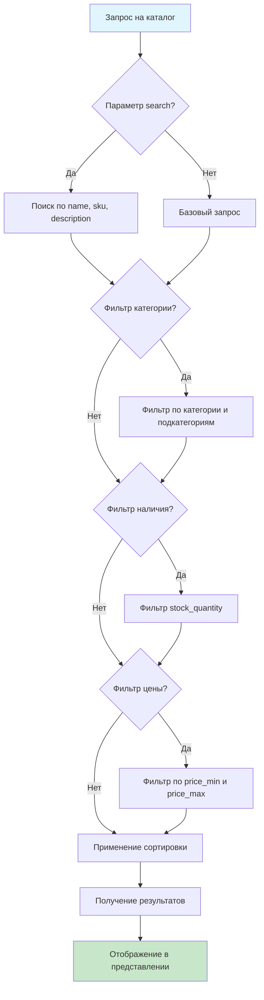
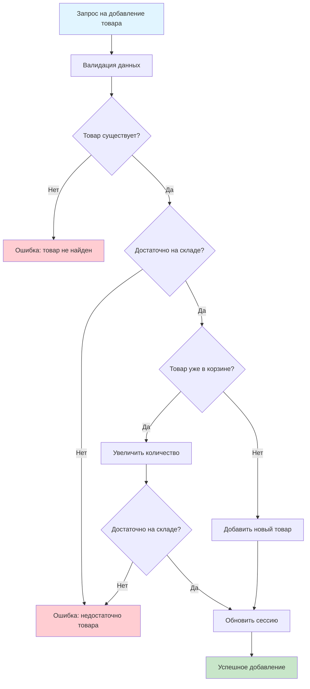
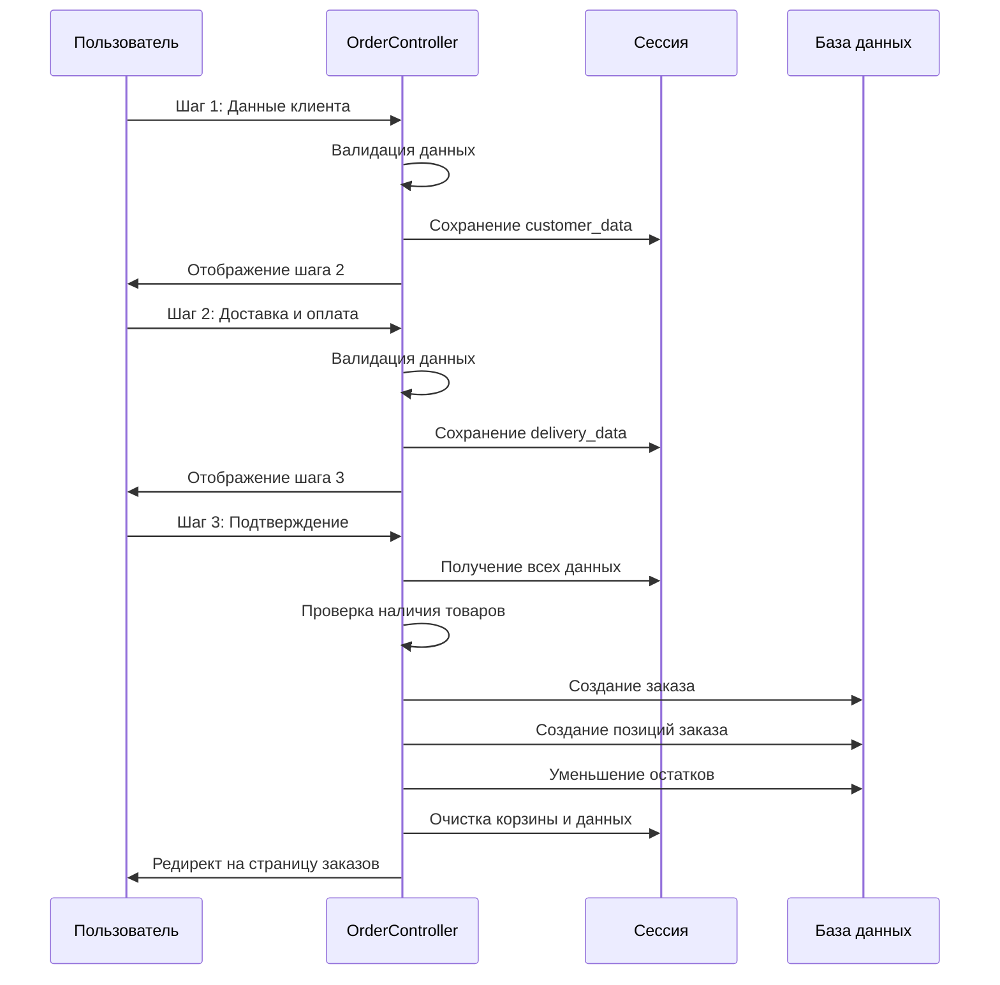
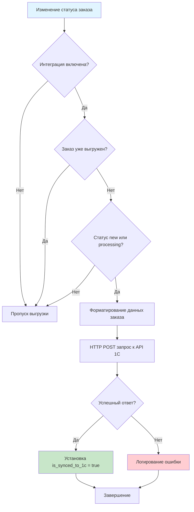

# 2.4. Реализация системы

## 2.4.1. Реализация модуля каталога товаров

Модуль каталога товаров обеспечивает отображение товаров, поиск, фильтрацию и навигацию по категориям. Реализация выполнена с использованием паттерна MVC и оптимизирована для работы с большим количеством товаров.

### Структура контроллеров и моделей

Модуль каталога включает следующие компоненты:

**Контроллер `CatalogController`** – обрабатывает запросы на отображение каталога товаров с поддержкой поиска и фильтрации.

**Контроллер `ProductController`** – обрабатывает запросы на отображение детальной информации о товаре.

**Модель `Product`** – представляет товар в системе, использует Eloquent ORM для взаимодействия с базой данных.

**Модель `Category`** – представляет категорию товаров с поддержкой иерархической структуры.

**Модель `ProductImage`** – представляет изображения товаров.

*[Рисунок 2.7 – Скриншот интерфейса каталога товаров с фильтрами и поиском]*

### Реализация поиска и фильтрации

Поиск товаров реализован с использованием SQL-запросов с условиями `LIKE` для поиска по названию, артикулу и описанию. Алгоритм поиска представлен на рисунке 2.8.



*Рисунок 2.8 – Алгоритм поиска и фильтрации товаров*

Ключевой фрагмент кода реализации поиска и фильтрации в контроллере `CatalogController`:

```php
// Поиск
if ($request->filled('search')) {
    $search = $request->search;
    $productsQuery->where(function($q) use ($search) {
        $q->where('name', 'like', "%{$search}%")
          ->orWhere('sku', 'like', "%{$search}%")
          ->orWhere('description', 'like', "%{$search}%");
    });
}

// Фильтр по категории (включая подкатегории)
if ($request->filled('category')) {
    $categoryId = $request->category;
    $category = Category::find($categoryId);
    
    if ($category) {
        $categoryIds = [$category->id];
        foreach ($category->children as $child) {
            $categoryIds[] = $child->id;
        }
        $productsQuery->whereIn('category_id', $categoryIds);
    }
}
```

*[Рисунок 2.9 – Фрагмент кода контроллера CatalogController с реализацией поиска]*

### Отображение товаров и категорий

Отображение товаров реализовано через Blade-шаблоны с использованием компонента `product-card.blade.php` для единообразного отображения карточек товаров.

**Структура представления каталога:**

1. **Панель фильтров** – содержит поля поиска, фильтры по категориям, цене, наличию и сортировке
2. **Сетка товаров** – отображает карточки товаров в адаптивной сетке (1-4 колонки в зависимости от размера экрана)
3. **Пагинация** – для навигации по страницам при большом количестве товаров

*[Рисунок 2.10 – Скриншот карточки товара в каталоге]*

**Модель `Product`** включает следующие отношения (relationships):

```php
public function category()
{
    return $this->belongsTo(Category::class);
}

public function images()
{
    return $this->hasMany(ProductImage::class);
}

public function mainImage()
{
    return $this->hasOne(ProductImage::class)->where('is_main', true);
}
```

*[Рисунок 2.11 – Фрагмент кода модели Product с определениями отношений]*

**Модель `Category`** поддерживает иерархическую структуру через самосвязь:

```php
public function parent()
{
    return $this->belongsTo(Category::class, 'parent_id');
}

public function children()
{
    return $this->hasMany(Category::class, 'parent_id');
}

public function products()
{
    return $this->hasMany(Product::class);
}
```

### Описание ключевых алгоритмов

**Алгоритм получения товаров с учетом иерархии категорий:**

При выборе категории система автоматически включает товары из всех подкатегорий. Это обеспечивается путем рекурсивного получения ID всех дочерних категорий и использования `whereIn` в запросе.

**Оптимизация запросов:**

Для предотвращения проблемы N+1 запросов используется eager loading:

```php
$productsQuery = Product::where('is_active', true)
    ->with('mainImage')
    ->with('category');
```

Это позволяет загрузить все необходимые связанные данные одним запросом вместо множества отдельных запросов для каждого товара.

*[Рисунок 2.12 – Скриншот страницы детального просмотра товара с галереей изображений и техническими характеристиками]*

## 2.4.2. Реализация модуля корзины и оформления заказа

Модуль корзины и оформления заказа обеспечивает управление выбранными товарами и процесс создания заказа. Реализация использует сессии Laravel для хранения данных корзины.

### Управление корзиной (сессии)

Корзина хранится в сессии пользователя в виде ассоциативного массива, где ключом является ID товара, а значением – массив с данными товара и количеством.

**Структура данных корзины в сессии:**

```php
$cart = [
    'product_id' => [
        'product' => Product object,
        'quantity' => integer
    ],
    // ...
];
```

*[Рисунок 2.13 – Скриншот интерфейса корзины с товарами]*

**Методы управления корзиной в `CartController`:**

1. **`add()`** – добавление товара в корзину с проверкой наличия на складе
2. **`update()`** – обновление количества товара в корзине
3. **`remove()`** – удаление товара из корзины
4. **`clear()`** – очистка всей корзины

Алгоритм добавления товара в корзину представлен на рисунке 2.14.



*Рисунок 2.14 – Алгоритм добавления товара в корзину*

**Ключевой фрагмент кода добавления товара:**

```php
public function add(Request $request)
{
    $request->validate([
        'product_id' => 'required|exists:products,id',
        'quantity' => 'required|integer|min:1'
    ]);

    $product = Product::findOrFail($request->product_id);
    
    // Проверяем наличие товара
    if ($product->stock_quantity < $request->quantity) {
        return back()->with('error', 'Недостаточно товара на складе.');
    }

    $cart = session('cart', []);
    $productId = $product->id;

    if (isset($cart[$productId])) {
        $newQuantity = $cart[$productId]['quantity'] + $request->quantity;
        if ($product->stock_quantity < $newQuantity) {
            return back()->with('error', 'Недостаточно товара на складе.');
        }
        $cart[$productId]['quantity'] = $newQuantity;
    } else {
        $cart[$productId] = [
            'product' => $product,
            'quantity' => $request->quantity
        ];
    }

    session(['cart' => $cart]);
    return back()->with('success', 'Товар добавлен в корзину!');
}
```

*[Рисунок 2.15 – Фрагмент кода метода add() контроллера CartController]*

### Трехшаговый процесс оформления заказа

Процесс оформления заказа разделен на три последовательных шага для упрощения и снижения количества ошибок. Данные каждого шага сохраняются в сессии и используются на следующих шагах.

**Шаг 1: Данные клиента** (`checkout-step1.blade.php`)

На первом шаге пользователь вводит контактные данные:
- Имя
- Телефон
- Email (опционально)
- Адрес доставки
- Комментарий к заказу (опционально)

*[Рисунок 2.16 – Скриншот первого шага оформления заказа (данные клиента)]*

**Шаг 2: Способ доставки и оплаты** (`checkout-step2.blade.php`)

На втором шаге пользователь выбирает:
- Способ доставки (самовывоз, курьер, транспортная компания)
- Способ оплаты (наличные, карта, банковский перевод)

*[Рисунок 2.17 – Скриншот второго шага оформления заказа (доставка и оплата)]*

**Шаг 3: Подтверждение заказа** (`checkout-step3.blade.php`)

На третьем шаге отображается сводная информация о заказе для подтверждения:
- Данные клиента
- Состав заказа
- Способ доставки и оплаты
- Итоговая сумма

*[Рисунок 2.18 – Скриншот третьего шага оформления заказа (подтверждение)]*

Алгоритм процесса оформления заказа представлен на рисунке 2.19.



*Рисунок 2.19 – Диаграмма последовательности процесса оформления заказа*

### Валидация данных

На каждом шаге оформления заказа выполняется валидация данных с использованием встроенных правил валидации Laravel:

**Валидация шага 1:**

```php
$request->validate([
    'customer_name' => 'required|string|max:255',
    'customer_phone' => 'required|string|max:20',
    'customer_email' => 'nullable|email|max:255',
]);
```

**Валидация шага 2:**

```php
$request->validate([
    'delivery_address' => 'required|string|max:500',
    'delivery_method' => 'required|in:pickup,courier,transport',
    'payment_method' => 'required|in:cash,card,transfer',
    'comment' => 'nullable|string|max:1000',
]);
```

*[Рисунок 2.20 – Фрагмент кода валидации данных в OrderController]*

При ошибках валидации пользователь возвращается на предыдущий шаг с отображением сообщений об ошибках.

### Личный кабинет клиента

Личный кабинет клиента реализован через метод `index()` контроллера `OrderController`, который отображает историю заказов пользователя.

**Функциональность личного кабинета:**

- Просмотр списка всех заказов пользователя
- Фильтрация заказов по статусу
- Просмотр детальной информации о заказе
- Отслеживание статуса заказа

*[Рисунок 2.21 – Скриншот страницы истории заказов клиента]*

**Код получения заказов пользователя:**

```php
public function index()
{
    if (!auth()->check()) {
        return redirect()->route('login');
    }

    $orders = Order::where('user_id', auth()->id())
                  ->with('items')
                  ->orderBy('created_at', 'desc')
                  ->get();

    return view('orders', compact('orders'));
}
```

## 2.4.3. Реализация модуля управления заказами

Модуль управления заказами обеспечивает обработку заказов администраторами, изменение статусов, отправку уведомлений и интеграцию с системой 1С.

### Система статусов заказов

Система поддерживает четыре статуса заказов:

- **`new`** – новый заказ, требует обработки
- **`processing`** – заказ в обработке
- **`completed`** – заказ выполнен
- **`cancelled`** – заказ отменен

Статусы хранятся в виде ENUM в базе данных, что обеспечивает валидацию на уровне БД.

*[Рисунок 2.22 – Скриншот страницы управления заказами в административной панели]*

**Методы проверки статуса в модели `Order`:**

```php
public function isNew()
{
    return $this->status === 'new';
}

public function isProcessing()
{
    return $this->status === 'processing';
}

public function isCompleted()
{
    return $this->status === 'completed';
}

public function isCancelled()
{
    return $this->status === 'cancelled';
}
```

*[Рисунок 2.23 – Фрагмент кода модели Order с методами проверки статуса]*

### Автоматическая отправка email-уведомлений

При изменении статуса заказа автоматически отправляется email-уведомление клиенту. Реализация выполнена через систему уведомлений Laravel.

**Класс уведомления `OrderStatusChanged`:**

```php
class OrderStatusChanged extends Notification implements ShouldQueue
{
    protected $order;
    protected $oldStatus;
    protected $newStatus;

    public function __construct(Order $order, string $oldStatus, string $newStatus)
    {
        $this->order = $order;
        $this->oldStatus = $oldStatus;
        $this->newStatus = $newStatus;
    }

    public function toMail($notifiable)
    {
        return (new MailMessage)
            ->subject('Изменение статуса вашего заказа #' . $this->order->id)
            ->greeting('Здравствуйте, ' . $this->order->customer_details['name'] . '!')
            ->line('Статус вашего заказа №' . $this->order->id . ' был изменен.')
            ->line('Предыдущий статус: ' . $oldStatusLabel)
            ->line('Новый статус: ' . $newStatusLabel)
            ->action('Посмотреть ваш заказ', url('/orders'));
    }
}
```

*[Рисунок 2.24 – Фрагмент кода класса уведомления OrderStatusChanged]*

**Отправка уведомления при изменении статуса:**

```php
public function updateOrderStatus(Request $request, $orderId)
{
    $order = Order::findOrFail($orderId);
    $oldStatus = $order->status;
    $newStatus = $request->status;
    
    $order->update(['status' => $newStatus]);

    // Отправка уведомления
    if ($order->user) {
        $order->user->notify(new OrderStatusChanged($order, $oldStatus, $newStatus));
    } else {
        // Для гостевых заказов отправка на email из customer_details
        if (isset($order->customer_details['email'])) {
            $tempUser = new User();
            $tempUser->email = $order->customer_details['email'];
            $tempUser->notify(new OrderStatusChanged($order, $oldStatus, $newStatus));
        }
    }
}
```

*[Рисунок 2.25 – Фрагмент кода отправки уведомления в AdminController]*

*[Рисунок 2.26 – Скриншот email-уведомления об изменении статуса заказа]*

### Интеграция с 1С:Предприятие

Интеграция с системой 1С реализована через сервисный класс `OneCService`, который инкапсулирует всю логику взаимодействия с API 1С.

**Автоматическая выгрузка заказов:**

При изменении статуса заказа на "new" или "processing" автоматически запускается процесс выгрузки заказа в 1С (если интеграция включена и заказ еще не был выгружен):

```php
if (in_array($newStatus, ['new', 'processing']) && 
    !$order->is_synced_to_1c && 
    config('services.onec.enabled')) {
    
    $oneCService = new OneCService();
    try {
        $oneCService->exportOrder($order);
        $order->update(['is_synced_to_1c' => true]);
    } catch (\Exception $e) {
        \Log::error("Ошибка выгрузки заказа #{$order->id} в 1С: " . $e->getMessage());
    }
}
```

*[Рисунок 2.27 – Фрагмент кода автоматической выгрузки заказа в 1С]*

### Описание алгоритма выгрузки заказов

Алгоритм выгрузки заказа в систему 1С представлен на рисунке 2.28.



*Рисунок 2.28 – Алгоритм выгрузки заказа в систему 1С*

**Метод форматирования данных для 1С:**

```php
protected function formatOrderFor1C(Order $order): array
{
    $items = [];
    foreach ($order->items as $item) {
        $items[] = [
            'sku' => $item->product_sku,
            'name' => $item->product_name,
            'quantity' => $item->quantity,
            'price' => (float) $item->price_at_purchase,
            'total' => (float) ($item->price_at_purchase * $item->quantity),
        ];
    }

    return [
        'order_id' => $order->id,
        'order_number' => 'ORD-' . str_pad($order->id, 6, '0', STR_PAD_LEFT),
        'date' => $order->created_at->format('Y-m-d\TH:i:s'),
        'status' => $this->mapStatusTo1C($order->status),
        'total_amount' => (float) $order->total_amount,
        'payment_method' => $this->mapPaymentMethodTo1C($order->payment_method),
        'delivery_method' => $this->mapDeliveryMethodTo1C($order->delivery_method),
        'customer' => [
            'name' => $order->customer_details['name'] ?? 'Гость',
            'phone' => $order->customer_details['phone'] ?? null,
            'email' => $order->customer_details['email'] ?? null,
            'address' => $order->customer_details['address'] ?? null,
        ],
        'items' => $items,
        'comment' => $order->customer_details['comment'] ?? null,
    ];
}
```

*[Рисунок 2.29 – Фрагмент кода метода formatOrderFor1C()]*

*[Рисунок 2.30 – Скриншот страницы управления интеграцией с 1С в административной панели]*

## 2.4.4. Реализация административной панели

Административная панель обеспечивает полное управление системой интернет-магазина через веб-интерфейс. Все функции доступны только пользователям с ролью "admin".

### Управление товарами (CRUD операции)

Управление товарами реализовано через ресурсный контроллер `ProductController` в пространстве имен `Admin`.

**Список товаров** (`index()`):

- Отображение таблицы товаров с пагинацией
- Поиск по названию и артикулу
- Фильтрация по категории и активности
- Ссылки на создание, редактирование и удаление товаров

*[Рисунок 2.31 – Скриншот страницы списка товаров в административной панели]*

**Создание товара** (`create()`, `store()`):

- Форма с полями: название, категория, артикул, описание, цена, остаток, статус
- Загрузка нескольких изображений
- Редактор технических характеристик (JSON)
- Валидация уникальности артикула

*[Рисунок 2.32 – Скриншот формы создания товара]*

**Редактирование товара** (`edit()`, `update()`):

- Аналогичная форма с предзаполненными данными
- Управление изображениями (добавление, удаление, установка главного)
- Обновление всех полей товара

*[Рисунок 2.33 – Скриншот формы редактирования товара с управлением изображениями]*

**Удаление товара** (`destroy()`):

- Мягкое удаление через установку `is_active = false` или полное удаление
- Проверка связанных заказов перед удалением

**Ключевой фрагмент кода создания товара:**

```php
public function store(Request $request)
{
    $validated = $request->validate([
        'name' => 'required|string|max:255',
        'category_id' => 'nullable|exists:categories,id',
        'sku' => 'required|string|max:100|unique:products,sku',
        'description' => 'nullable|string',
        'price' => 'required|numeric|min:0',
        'stock_quantity' => 'required|integer|min:0',
        'is_active' => 'boolean',
        'technical_specs' => 'nullable|array',
        'images' => 'nullable|array',
        'images.*' => 'image|mimes:jpeg,png,jpg,gif|max:2048',
    ]);

    $validated['slug'] = Str::slug($validated['name']);
    
    if (isset($validated['technical_specs'])) {
        $validated['technical_specs'] = json_encode($validated['technical_specs']);
    }

    $product = Product::create($validated);

    // Загрузка изображений
    if ($request->hasFile('images')) {
        foreach ($request->file('images') as $index => $image) {
            $path = $image->store('product_images', 'public');
            ProductImage::create([
                'product_id' => $product->id,
                'path' => $path,
                'is_main' => $index === 0,
                'sort_order' => $index,
            ]);
        }
    }

    return redirect()->route('admin.products.index')
        ->with('success', 'Товар успешно создан');
}
```

*[Рисунок 2.34 – Фрагмент кода метода store() контроллера ProductController]*

### Управление категориями

Управление категориями реализовано через ресурсный контроллер `CategoryController` с поддержкой иерархической структуры.

**Функциональность:**

- Создание категорий с указанием родительской категории
- Редактирование категорий
- Удаление категорий (с проверкой наличия товаров)
- Отображение иерархической структуры в списке

*[Рисунок 2.35 – Скриншот страницы управления категориями с иерархической структурой]*

**Код создания категории:**

```php
public function store(Request $request)
{
    $validated = $request->validate([
        'name' => 'required|string|max:255',
        'parent_id' => 'nullable|exists:categories,id',
        'description' => 'nullable|string',
    ]);

    $validated['slug'] = Str::slug($validated['name']);

    Category::create($validated);

    return redirect()->route('admin.categories.index')
        ->with('success', 'Категория успешно создана');
}
```

*[Рисунок 2.36 – Скриншот формы создания категории]*

### Управление заказами

Управление заказами реализовано в контроллере `AdminController` и включает:

- Просмотр списка заказов с фильтрацией и поиском
- Просмотр детальной информации о заказе
- Изменение статуса заказа
- Ручная выгрузка заказа в 1С

*[Рисунок 2.37 – Скриншот страницы детального просмотра заказа]*

**Код изменения статуса заказа:**

```php
public function updateOrderStatus(Request $request, $orderId)
{
    $request->validate([
        'status' => 'required|in:new,processing,completed,cancelled'
    ]);

    $order = Order::findOrFail($orderId);
    $oldStatus = $order->status;
    $newStatus = $request->status;
    
    $order->update(['status' => $newStatus]);

    // Автоматическая выгрузка в 1С
    if (in_array($newStatus, ['new', 'processing']) && 
        !$order->is_synced_to_1c && 
        config('services.onec.enabled')) {
        $oneCService = new OneCService();
        try {
            $oneCService->exportOrder($order);
            $order->update(['is_synced_to_1c' => true]);
        } catch (\Exception $e) {
            \Log::error("Ошибка выгрузки заказа #{$order->id} в 1С: " . $e->getMessage());
        }
    }

    // Отправка уведомления
    if ($order->user) {
        $order->user->notify(new OrderStatusChanged($order, $oldStatus, $newStatus));
    }

    return back()->with('success', "Статус заказа #{$orderId} изменен.");
}
```

*[Рисунок 2.38 – Фрагмент кода метода updateOrderStatus()]*

### Управление пользователями

Управление пользователями реализовано через ресурсный контроллер `UserController` и включает:

- Просмотр списка пользователей
- Создание новых пользователей
- Редактирование данных пользователей (имя, email, телефон, роль)
- Удаление пользователей (с защитой от удаления текущего администратора)

*[Рисунок 2.39 – Скриншот страницы управления пользователями]*

**Защита от удаления текущего администратора:**

```php
public function destroy($id)
{
    $user = auth()->user();
    if ($user->id == $id) {
        return back()->with('error', 'Вы не можете удалить свой собственный аккаунт');
    }

    User::findOrFail($id)->delete();
    return back()->with('success', 'Пользователь успешно удален');
}
```

*[Рисунок 2.40 – Скриншот формы редактирования пользователя]*

### Аналитика и отчетность

Дашборд административной панели отображает основную статистику:

- Общее количество заказов
- Количество новых заказов
- Количество активных заказов (в обработке)
- Общее количество пользователей
- Список последних заказов

*[Рисунок 2.41 – Скриншот дашборда административной панели со статистикой]*

**Код получения статистики:**

```php
public function dashboard()
{
    $stats = [
        'total_orders' => Order::count(),
        'new_orders' => Order::where('status', 'new')->count(),
        'active_orders' => Order::whereIn('status', ['new', 'processing'])->count(),
        'total_users' => User::count()
    ];

    $recent_orders = Order::with(['user', 'items'])
                        ->orderBy('created_at', 'desc')
                        ->take(5)
                        ->get();

    return view('admin.dashboard', compact('stats', 'recent_orders'));
}
```

## 2.4.5. Реализация интеграции с 1С:Предприятие

Интеграция с системой 1С:Предприятие реализована через сервисный класс `OneCService`, который инкапсулирует всю логику взаимодействия с REST API системы 1С.

### Сервис интеграции (OneCService)

Класс `OneCService` обеспечивает:

- Выгрузку заказов в систему 1С
- Форматирование данных заказов для API 1С
- Обработку ответов от системы 1С
- Логирование операций интеграции

**Конструктор класса:**

```php
public function __construct()
{
    $this->baseUrl = config('services.onec.base_url');
    $this->username = config('services.onec.username');
    $this->password = config('services.onec.password');
    $this->enabled = config('services.onec.enabled', false);
}
```

*[Рисунок 2.42 – Фрагмент кода конструктора OneCService]*

**Метод выгрузки заказа:**

```php
public function exportOrder(Order $order): bool
{
    if (!$this->enabled) {
        Log::info('1C integration is disabled', ['order_id' => $order->id]);
        return false;
    }

    if ($order->is_synced_to_1c) {
        Log::info('Order already synced to 1C', ['order_id' => $order->id]);
        return true;
    }

    try {
        $orderData = $this->formatOrderFor1C($order);

        $response = Http::timeout(30)
            ->withBasicAuth($this->username, $this->password)
            ->post($this->baseUrl . '/api/orders', $orderData);

        if ($response->successful()) {
            $order->update(['is_synced_to_1c' => true]);
            Log::info('Order successfully exported to 1C', [
                'order_id' => $order->id,
                'response' => $response->json()
            ]);
            return true;
        } else {
            Log::error('Failed to export order to 1C', [
                'order_id' => $order->id,
                'status' => $response->status(),
                'response' => $response->body()
            ]);
            return false;
        }
    } catch (\Exception $e) {
        Log::error('Exception while exporting order to 1C', [
            'order_id' => $order->id,
            'error' => $e->getMessage()
        ]);
        return false;
    }
}
```

*[Рисунок 2.43 – Фрагмент кода метода exportOrder()]*

### Форматирование данных для 1С

Метод `formatOrderFor1C()` преобразует данные заказа из формата базы данных в формат, ожидаемый API системы 1С.

**Маппинг статусов:**

```php
protected function mapStatusTo1C(string $status): string
{
    $map = [
        'new' => 'Новый',
        'processing' => 'В обработке',
        'completed' => 'Выполнен',
        'cancelled' => 'Отменен',
    ];
    return $map[$status] ?? $status;
}
```

**Маппинг способов оплаты:**

```php
protected function mapPaymentMethodTo1C(string $method): string
{
    $map = [
        'cash' => 'Наличные',
        'card' => 'Банковская карта',
        'transfer' => 'Банковский перевод',
    ];
    return $map[$method] ?? $method;
}
```

**Маппинг способов доставки:**

```php
protected function mapDeliveryMethodTo1C(string $method): string
{
    $map = [
        'pickup' => 'Самовывоз',
        'courier' => 'Курьерская доставка',
        'transport' => 'Транспортная компания',
    ];
    return $map[$method] ?? $method;
}
```

*[Рисунок 2.44 – Фрагмент кода методов маппинга данных для 1С]*

### Обработка ответов от 1С

Система обрабатывает различные типы ответов от API 1С:

- **Успешный ответ (HTTP 200-299):** заказ помечается как синхронизированный (`is_synced_to_1c = true`)
- **Ошибка клиента (HTTP 400-499):** логируется ошибка, заказ остается несинхронизированным
- **Ошибка сервера (HTTP 500-599):** логируется ошибка, возможна повторная попытка
- **Исключения (таймаут, сетевые ошибки):** логируются, заказ остается несинхронизированным

Все ошибки логируются в файл `storage/logs/laravel.log` с детальной информацией для последующего анализа.

*[Рисунок 2.45 – Скриншот логов интеграции с 1С]*

### Интерфейс управления интеграцией

В административной панели реализован интерфейс управления интеграцией с 1С (`/admin/onec`), который позволяет:

- Просмотр статуса интеграции (включена/выключена)
- Просмотр статистики синхронизации
- Просмотр списка невыгруженных заказов
- Ручная выгрузка отдельных заказов
- Массовая выгрузка всех невыгруженных заказов

*[Рисунок 2.46 – Скриншот страницы управления интеграцией с 1С]*

**Код массовой выгрузки:**

```php
public function exportAll(Request $request)
{
    $pendingOrders = Order::where('is_synced_to_1c', false)
                        ->whereIn('status', ['new', 'processing'])
                        ->get();

    $successCount = 0;
    $errorCount = 0;

    foreach ($pendingOrders as $order) {
        try {
            $this->oneCService->exportOrder($order);
            $successCount++;
        } catch (\Exception $e) {
            Log::error("Ошибка выгрузки заказа #{$order->id} в 1С: " . $e->getMessage());
            $errorCount++;
        }
    }

    $message = "Выгрузка завершена. Успешно: {$successCount}. Ошибок: {$errorCount}.";
    return back()->with('success', $message);
}
```

*[Рисунок 2.47 – Фрагмент кода массовой выгрузки заказов]*

### Выводы по разделу

Реализация системы выполнена с использованием современных подходов разработки веб-приложений на Laravel. Модульная архитектура обеспечивает разделение ответственности между компонентами, что упрощает сопровождение и расширение системы.

Использование сессий для хранения корзины обеспечивает простоту реализации и хорошую производительность. Трехшаговый процесс оформления заказа снижает количество ошибок и повышает удобство использования.

Интеграция с системой 1С реализована через сервисный класс, что обеспечивает инкапсуляцию логики и возможность легкого тестирования. Автоматическая выгрузка заказов при изменении статуса и возможность ручной выгрузки обеспечивают гибкость в работе с системой учета.

Административная панель предоставляет полный набор инструментов для управления системой, включая CRUD-операции для всех основных сущностей, управление заказами и интеграцию с внешними системами.

