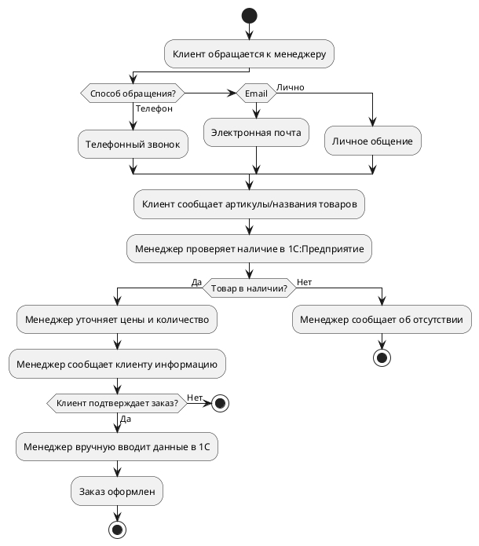

# Диаграммы бизнес-процессов для дипломной работы

## Формат диаграмм

Диаграммы созданы в формате **Mermaid**, который поддерживается:
- GitHub (автоматически отображается в .md файлах)
- VS Code (с расширением "Markdown Preview Mermaid Support")
- Многие другие редакторы Markdown
- Онлайн-редакторы: https://mermaid.live/

## Как использовать диаграммы

### Вариант 1: Использовать в Markdown документе
Диаграммы уже включены в файл `DIPLOMA_CHAPTER1_SECTION1.1.md` и будут автоматически отображаться в редакторах с поддержкой Mermaid.

### Вариант 2: Экспортировать в изображения
1. Откройте https://mermaid.live/
2. Вставьте код диаграммы
3. Нажмите "Actions" → "Download PNG" или "Download SVG"
4. Вставьте изображение в документ Word/LaTeX

### Вариант 3: Использовать в Word документе
1. Экспортируйте диаграмму как PNG/SVG (см. вариант 2)
2. Вставьте изображение в Word
3. Добавьте подпись: "Рисунок 1.1 – Схема процесса приема заказа"

## Альтернативные форматы

Если требуется использовать другие форматы диаграмм, можно использовать:

### PlantUML


### Текстовая блок-схема (для Word)
```
┌─────────────────────────┐
│ Клиент обращается к     │
│ менеджеру               │
└───────────┬─────────────┘
            │
            ▼
    ┌───────────────┐
    │ Способ        │
    │ обращения?    │
    └───┬───┬───┬───┘
        │   │   │
    ┌───┘   │   └───┐
    │       │       │
    ▼       ▼       ▼
  Телефон Email  Лично
```

## Рекомендации по оформлению

1. **Нумерация рисунков**: Рисунок 1.1, Рисунок 1.2, Рисунок 1.3 (где 1 - номер главы, 1,2,3 - порядковый номер)

2. **Подписи к рисункам**: 
   - Рисунок 1.1 – Схема процесса приема заказа
   - Рисунок 1.2 – Схема процесса обработки заказа
   - Рисунок 1.3 – Схема процесса информирования клиентов

3. **Ссылки в тексте**: "Схема процесса приема заказа представлена на рисунке 1.1."

4. **Размещение**: Рисунки размещаются сразу после первого упоминания в тексте или на следующей странице.

5. **Качество**: При экспорте используйте разрешение не менее 300 DPI для печати.

## Цветовая схема диаграмм

- **Голубой** (#e1f5ff) - Начало процесса
- **Зеленый** (#c8e6c9) - Конец процесса (успешное завершение)
- **Красный** (#ffcdd2) - Ошибки, проблемы, ожидание
- **Желтый** (#fff9c4) - Важные операции, проверки

## Дополнительные инструменты

- **Draw.io** (https://app.diagrams.net/) - бесплатный редактор диаграмм
- **Lucidchart** - профессиональный инструмент для создания диаграмм
- **Microsoft Visio** - для создания профессиональных схем

